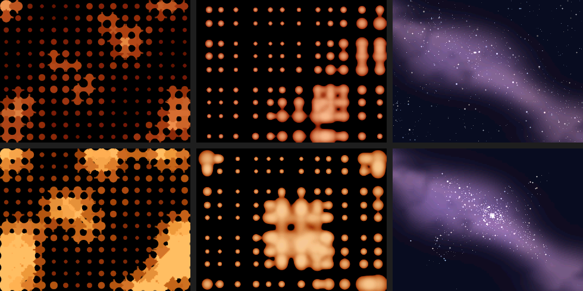

# stackchan-droplet

Sound-reactive idle screens for the **M5Stack StackChan** factory firmware — added as one extra app, so everything else (AI Agent, avatar, phone-app binding, servo calibration) keeps working.



Top row: quiet. Bottom row: with sound. Left to right: **Dots**, **Blob**, **Galaxy**.

## What it does

| Style | Look | Sound reaction |
|---|---|---|
| **Dots** (default) | 16×12 dot lattice. Dots grow and merge through fillet "necks" like liquid capsules. Orange‑red gradient, anti‑aliased (signed‑distance rendering). | Dots grow, the pattern flows faster, colours brighten. |
| **Blob** | 12×9 lattice rendered as true metaballs — droplets swell and melt into puddles. | Puddles grow and ripple from the centre. |
| **Galaxy** | 700 stars with parallax drift and twinkle over a Milky‑Way dust band (procedural fbm nebula with dark lanes). | Stars are pulled into a cluster while the sound lasts, then burst apart and drift home. |

- **Idle screensaver**: replaces the launcher's DVD‑logo screensaver (after 30 s without touch). Touch the screen to return.
- **App**: a `DROPLET` icon in the launcher opens the same scene full‑screen. Tap to exit.
- **Switch style**: swipe the head‑top touch panel (forward or backward): Dots → Blob → Galaxy → Dots. The choice is saved in NVS (`droplet/style`).
- **Nod on loud sound**: when the adaptive loudness level goes above 0.55 (a voice near the robot), StackChan nods once (pitch +22°, 8 s cooldown). If the head was left raised, the scene homes it on start.
- **Microphone**: the codec input is read directly (RMS of 120 frames every 33 ms). Nothing is recorded or sent anywhere; only one number (level) is used. The launcher stage has no audio pipeline running, so there is no conflict.

Measured on a StackChan (ESP32‑S3, 320×240): Dots 47 ms, Blob 37 ms, Galaxy 31 ms per frame (≈20–30 fps).

## Requirements

- [m5stack/StackChan](https://github.com/m5stack/StackChan) firmware source at **v1.5.1** (commit `1b57655`). Other versions probably work; the wiring patch touches only four lines.
- ESP‑IDF **v5.5.4** (what the factory firmware uses).
- A StackChan that boots into the launcher (`startAiAgentOnBoot` off — the default).

## Install

```bash
git clone https://github.com/m5stack/StackChan
cd StackChan/firmware && python3 fetch_repos.py && cd ..

git clone https://github.com/parkds-claude/stackchan-droplet
./stackchan-droplet/install.sh ./StackChan      # copies main/apps/app_droplet + applies patches/wiring.patch

cd StackChan/firmware
. $IDF_PATH/export.sh
idf.py build
idf.py -p /dev/cu.usbmodemXXXX app-flash        # app partition only
```

**Do not `erase-flash`.** `app-flash` writes only the application slot; NVS (account binding, Wi‑Fi, servo zero positions) and the assets partition stay intact. Back up NVS first if you want to be safe:

```bash
esptool --port /dev/cu.usbmodemXXXX read-flash 0x9000 0x4000 nvs-backup.bin
```

To go back to the stock firmware, re‑flash the official release from M5Burner (or your own backup of the app slot).

### What the wiring patch changes

If `git apply` fails on a different firmware version, do these four edits by hand:

1. `main/apps/apps.h` — add `#include "app_droplet/app_droplet.h"`.
2. `main/main.cpp` — add `GetMooncake().installApp(std::make_unique<AppDroplet>());` next to the other `installApp` lines.
3. `main/apps/app_launcher/app_launcher.h` — include `<apps/app_droplet/droplet_scene.h>` and change the member `std::unique_ptr<view::Screensaver> _screensaver;` to `std::unique_ptr<droplet::DropletScene> _screensaver;`.
4. `main/apps/app_launcher/app_launcher.cpp` — in `screensaver_update()` create `droplet::DropletScene` instead of `view::Screensaver`.

Skip steps 3–4 if you only want the launcher icon and prefer to keep the original DVD screensaver.

## Notes and caveats

- **Automatic OTA**: when the AI Agent starts it checks M5Stack's OTA server. If a newer official firmware exists it will overwrite this build (your stock features stay; only the DROPLET app disappears). Re‑install after an update. `PROJECT_VER` is left at 1.5.1 on purpose so nothing is blocked.
- **Head‑touch sensor**: the Si12T panel can report a swipe when nothing touched it. The scene ignores swipes in the first 1.5 s and repeats within 1.2 s. If your unit flips styles by itself, raise `SWIPE_REPEAT_MS` in `droplet_scene.h` or disable the swipe handler.
- **Battery**: the launcher's power‑save timer is not reset by the screensaver (same as the stock DVD screensaver), so on battery the robot may sleep after a few minutes. On USB power it does not matter.
- **Memory**: the canvas (150 KB) lives in PSRAM. Do not turn the half‑resolution buffers into full‑resolution static arrays — internal DRAM will overflow at link time.

## Tuning

Everything lives at the top of the files:

| File | Constant | Meaning |
|---|---|---|
| `droplet_field.h/.cpp` | `HUE_CENTER`, `HUE_SWING` | colour range (default orange‑red) |
| | `T_STEP_BASE`, `T_STEP_GAIN` | pattern speed, and how much sound speeds it up |
| | `LEVEL_LIFT` | how much sound enlarges the droplets |
| | `FILLET_R`, `NECK_MIN` | neck thickness / when two dots connect (Dots) |
| | `REACH` | metaball reach (Blob) |
| `galaxy_field.h/.cpp` | `N_STARS`, pull/burst factors in `step()` | star count, gather strength, scatter impulse |
| `droplet_scene.h` | `VOICE_NOD_LEVEL`, `VOICE_NOD_COOLDOWN_MS`, `NOD_PITCH_DELTA` | nod trigger and motion |
| | `FRAME_MS` | frame period |
| | `ENV_ATTACK/RELEASE`, `FLOOR_RISE`, `LEVEL_OCTAVES` (`droplet_field.h`) | adaptive loudness level |

## Preview on your computer

`droplet_field` and `galaxy_field` have no ESP or LVGL dependencies, so you can render frames on a PC:

```bash
c++ -O2 -std=c++17 -I main/apps/app_droplet main/apps/app_droplet/droplet_field.cpp tools/droplet_host_preview.cpp -o dp && ./dp out.ppm
c++ -O2 -std=c++17 -I main/apps/app_droplet main/apps/app_droplet/galaxy_field.cpp  tools/galaxy_host_preview.cpp  -o gx && ./gx galaxy.ppm
```

## How it is built

- `droplet_field` — pure renderer. Dots: per‑pixel signed distance of (circles ∪ fillet necks) evaluated at half resolution, bilinearly interpolated, 1‑px anti‑aliasing, colour by radius. Blob: finite‑support metaball kernel `K·(1−(d/R)²)²` summed over the 3×3 neighbouring lattice points. Both use lookup tables and 32‑bit integer maths in the hot loops.
- `galaxy_field` — particles with per‑star depth, twinkle and colour temperature; nebula is a 64×48 value‑noise fbm texture with a wobbling diagonal band and dark lanes, sampled with clamped bilinear interpolation.
- `droplet_scene` — LVGL screen + canvas, microphone level, nod state machine, head‑swipe style cycling, NVS persistence.
- `app_droplet` — the Mooncake `AppAbility`.

Inspired by the idle screen of [brushknight](https://www.threads.com/@brushknight)'s wall panel and the dot‑matrix device concepts of kindofdevice. Metaball technique references: Jamie Wong's *Metaballs and Marching Squares*, Paper.js *Meta Balls* (Hiroyuki Sato), xscreensaver `metaballs.c`.

## License

MIT. The StackChan firmware itself is MIT‑licensed by M5Stack; this repository only adds files and a small patch to it.

---

## 한국어

StackChan 공장 펌웨어에 **앱 하나를 더해** 넣는 소음 반응 유휴 화면입니다. 기존 앱·폰 앱 연동·서보 설정은 그대로 유지됩니다.

- 스타일 3종: **Dots**(도트가 물방울처럼 이어짐, 주황‑레드) / **Blob**(메타볼 액체) / **Galaxy**(은하수, 소리에 별이 모였다 흩어짐). 머리 위 터치 패널을 쓸어넘기면 순환하며 선택이 저장됩니다.
- 런처에서 30초 방치 시 스크린세이버로 뜨고, 런처 아이콘 `DROPLET`으로 직접 열 수도 있습니다. 화면을 터치하면 돌아갑니다.
- 큰 소리·목소리가 들리면 고개를 한 번 끄덕입니다(8초 쿨다운).
- 설치: 위 Install 절차대로 `install.sh` 실행 → `idf.py build` → `idf.py app-flash`. **절대 `erase-flash` 하지 마세요**(계정 바인딩·서보 영점이 지워집니다).
- 주의: AI Agent 실행 시 공식 OTA가 새 버전을 받으면 이 빌드가 덮여 앱만 사라집니다(재설치하면 됩니다).
